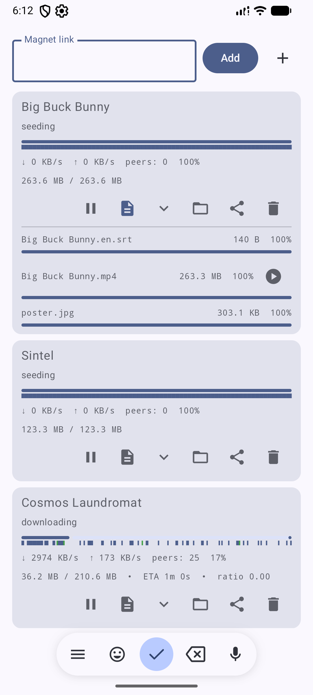

# SimpleTorrent

A minimal, fully native BitTorrent client for Android, built as a learning project to explore the
Android NDK and the libtorrent-rasterbar C++ library.

## Features

- Add torrents via magnet links or `.torrent` files
- Create `.torrent` files from any file or folder on the device and seed them immediately
- Real-time piece-map visualization (missing / downloaded / actively transferring)
- Collapsible per-torrent peer list (top 5 by download speed, refreshed every 3 s)
- Collapsible per-file progress list — file name, size, and individual download progress bar
- ETA, total size, and upload ratio on each card (e.g. `151.7 MB / 263.6 MB  •  ETA 27s  •  ratio 0.42`)
- Sequential download + in-app ExoPlayer — tap Play (≥ 5 % downloaded) to watch before the file is complete; position is remembered across sessions and cleared when the torrent is deleted
- Pause, resume, and delete torrents (with optional file removal)
- Persistent sessions — resume data is saved on `onStop` and restored on next launch
- Share `.torrent` files to other clients via the system share sheet
- Adaptive multi-column grid — 1 column on phones, 2 on foldables, 3 on tablets
- Full edge-to-edge UI with proper IME insets, Material You theming

## Demo

https://github.com/user-attachments/assets/6182efdb-9862-47ee-9fa7-011a64ee87eb

## Screenshots

| Torrent list with live download |
|---|
|  |

## Technical Stack

| Layer | Technology |
|---|---|
| BitTorrent engine | [libtorrent-rasterbar](https://libtorrent.org) RC_2_0 (C++17, BSD-3-Clause) |
| Native bridge | Android NDK r29, JNI (`torrent_jni.cpp`) |
| Build system | CMake 3.22, Gradle AGP 9.0.1 |
| Language | Kotlin 2.3.20 |
| UI | Jetpack Compose (BOM 2026.03.01), Material3 |
| Media playback | Media3 ExoPlayer 1.10.1 |
| Navigation | Jetpack Navigation3 1.0.1 |
| Architecture | MVVM — `ViewModel` + `StateFlow` + `DataRepository` |
| Serialization | kotlinx.serialization 1.8.1 (JSON bridge between JNI and Kotlin) |
| Async | Kotlin Coroutines 1.10.2 |
| Adaptive layout | `LazyVerticalGrid` + `GridCells.Adaptive(300.dp)` — phone / foldable / tablet |
| Testing | JUnit 4, kotlinx-coroutines-test, Compose UI Test |
| Release shrinking | R8 (`isMinifyEnabled`, `isShrinkResources`) with targeted ProGuard rules for JNI and kotlinx.serialization |
| CI | GitHub Actions (unit tests on Ubuntu; NDK build & UI tests on macOS M1) |

## Project Structure

```
SimpleTorrent/
├── app/src/main/
│   ├── cpp/
│   │   ├── CMakeLists.txt          # NDK build config; Boost ASIO workaround for Clang 21
│   │   └── torrent_jni.cpp         # JNI bridge (session, alerts, file_progress, sequential download)
│   ├── java/com/jpcottin/simpletorrent/
│   │   ├── MainActivity.kt         # Lifecycle: init / onStop resume-data save / onDestroy release
│   │   ├── Navigation.kt           # Navigation3 host (Main + Player routes)
│   │   ├── NavigationKeys.kt       # Serializable NavKey types: Main, Player(filePath, title)
│   │   ├── data/
│   │   │   ├── TorrentManager.kt   # Singleton: loads .so, data classes, JNI declarations
│   │   │   └── DataRepository.kt   # Interface + DefaultImpl polling every 3 s
│   │   ├── theme/
│   │   │   ├── Color.kt            # Material You color tokens
│   │   │   ├── Theme.kt            # SimpleTorrentTheme
│   │   │   └── Type.kt             # Typography scale
│   │   └── ui/
│   │       ├── main/
│   │       │   ├── MainScreen.kt       # Compose UI: cards, piece map, file list, peer list
│   │       │   └── MainScreenViewModel.kt
│   │       └── player/
│   │           └── PlayerScreen.kt     # ExoPlayer fullscreen player; position saved per file path
│   └── res/
│       ├── drawable/               # Adaptive icon (vector magnet)
│       └── xml/file_provider_paths.xml
├── libs/libtorrent/                # Git submodule (RC_2_0 branch)
├── .github/workflows/android.yml  # CI pipeline
├── LICENSE                        # MIT (app) + BSD-3-Clause (libtorrent)
└── README.md
```

## Architecture

```
Compose UI  (MainScreen / PlayerScreen)
    │  collectAsStateWithLifecycle
    ▼
MainScreenViewModel (StateFlow)
    │  suspend / direct calls
    ▼
DataRepository (interface)         ← FakeRepository in tests
    │
    ▼
TorrentManager (Kotlin object)
    │  JNI
    ▼
libsimpletorrent.so  (C++17)
    │
    ▼
libtorrent-rasterbar session
```

The JNI bridge serialises torrent state to a JSON string on each 3-second poll. This keeps
the Kotlin/C++ boundary thin — the Kotlin side only deals with plain data classes, never
with raw native pointers.

Sequential download (`set_sequential_download`) is enabled when the user taps Play, shifting
libtorrent's piece-selection strategy from rarest-first to front-to-back so ExoPlayer can
start playback before the file is complete. The strategy is best-effort: if peers lack early
pieces, libtorrent skips ahead and fills gaps later.

Local peer discovery (LSD) is tuned to announce every 15 seconds (libtorrent's default
is 5 minutes). This makes peers on the same LAN — or two emulators on the same host —
find each other almost immediately. Public trackers are also embedded in created torrents
for internet-wide reachability, but they cannot cross-connect two peers behind the same
NAT (e.g. two emulators sharing a host's IP).

## Building

### Prerequisites

| Tool | Version |
|---|---|
| Android Studio | Meerkat or newer |
| NDK | r29 (`29.0.14206865`) |
| CMake | 3.22.1 |
| Boost headers | 1.88 or newer (header-only; needed by libtorrent) |
| JDK | 17 |

### macOS (development)

```bash
# 1. Install Boost (header-only, needed for libtorrent's cmake config)
brew install boost

# 2. Clone with submodules
git clone --recurse-submodules https://github.com/jpcottin/SimpleTorrent.git
cd SimpleTorrent

# 3. Open in Android Studio and run, or build from the command line:
./gradlew assembleDebug
adb install app/build/outputs/apk/debug/app-debug.apk
```

If Boost is installed at a non-default Homebrew path, set:

```bash
export BOOST_CMAKE_DIR=/path/to/cmake/Boost-X.Y.Z
./gradlew assembleDebug
```

### Linux (CI / headless)

```bash
sudo apt-get install -y libboost-dev

BOOST_CMAKE_DIR=$(find /usr -name "BoostConfig.cmake" 2>/dev/null \
                  | head -1 | xargs dirname)
export BOOST_CMAKE_DIR
./gradlew assembleDebug
```

## Running Tests

```bash
# JVM unit tests (no device/emulator required)
./gradlew testDebugUnitTest

# Instrumented UI tests (requires a connected device or running emulator)
./gradlew connectedDebugAndroidTest
```

## CI/CD

GitHub Actions runs four jobs on every push / pull request to `master` or `main`:

| Job | Runner | Triggers |
|---|---|---|
| **Unit Tests** | `ubuntu-latest` | every push / PR |
| **Build APK** | `macos-14` (M1) | every push / PR |
| **Lint** | `ubuntu-latest` | every push / PR |
| **Instrumented Tests** | `ubuntu-latest` + emulator | pushes to `master` / `main` only |

Artifacts (APK, test reports, lint HTML) are uploaded for every run.

## Permissions

| Permission | Reason |
|---|---|
| `INTERNET` | BitTorrent peer connections |
| `MANAGE_EXTERNAL_STORAGE` | Write directly to public Downloads folder (API 30+) |
| `WRITE_EXTERNAL_STORAGE` | Fallback for API ≤ 28 |
| `READ_EXTERNAL_STORAGE` | Fallback for API ≤ 32 |

## License

The application source code is released under the **MIT License** — see [`LICENSE`](LICENSE).

This project links against **libtorrent-rasterbar**, which is distributed under the
**BSD 3-Clause License**. The full text of both licenses is included in [`LICENSE`](LICENSE).
